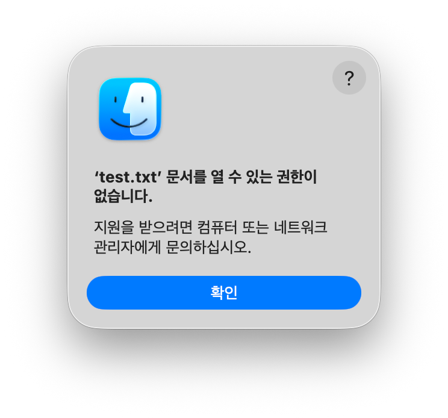
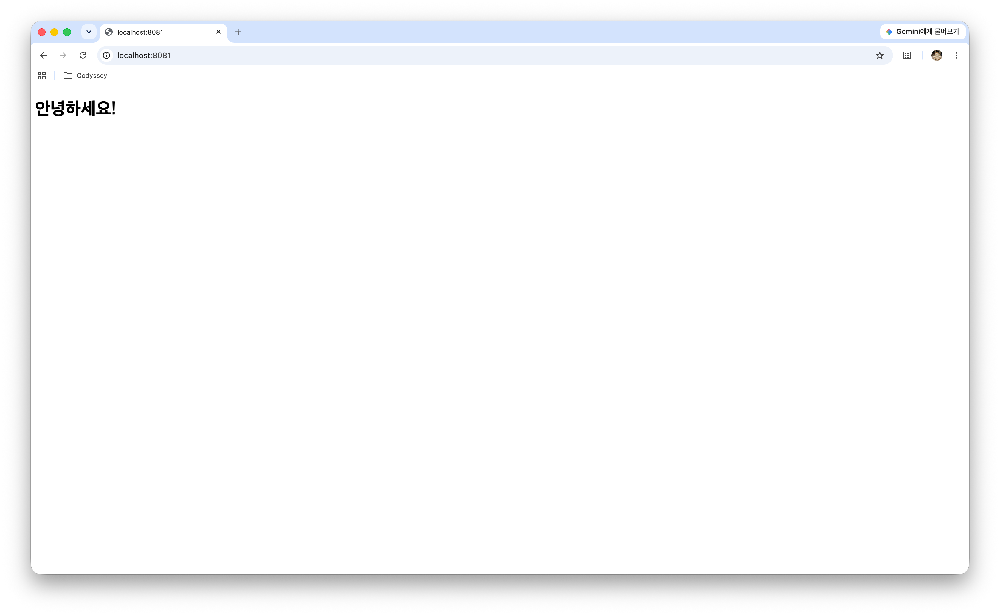
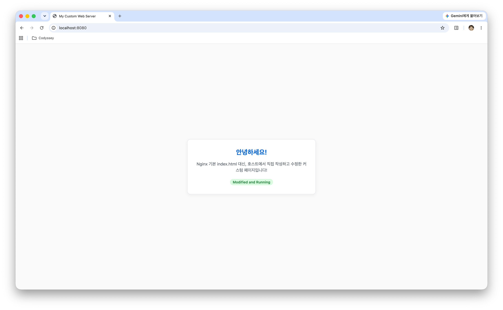
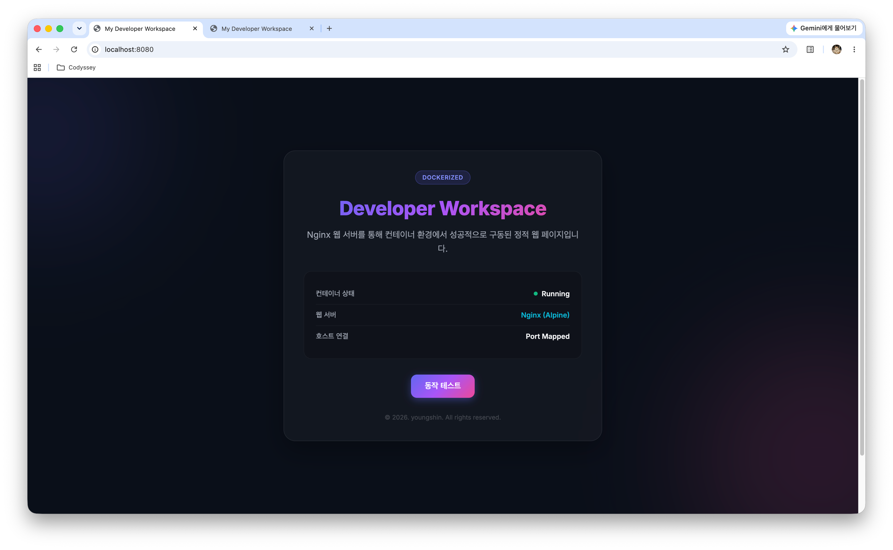

# Codyssey-E1-1: 내 컴퓨터에 개발자용 '작업실' 꾸미기
## 프로젝트 개요
이번 미션의 목표는 리눅스 CLI(터미널), Docker, Git/GitHub을 직접 세팅해보며, 내가 만든 코드/프로젝트를 다른 컴퓨터에서도 손쉽게 재현 가능할 수 있는 실행 환경을 구축해보는 것이다.

----
## 💡 목차
1. [실행 환경](#1️⃣-실행-환경)
2. [디렉토리 구조](#2️⃣-디렉토리-구조)
3. [GitHub 연동](#3️⃣-github-연동)
4. [명령어](#4️⃣-명령어)
5. [Terminal](#5️⃣-terminal)
6. [Docker](#6️⃣-docker)  
7. [트러블슈팅](#⚠️-트러블슈팅)
-----

## 1️⃣ 실행 환경
|        |        |
| ------ | ------ |
| OS     | mac OS |
| Shell  | zsh    |
| Docker(OrbStack) | 29.4.0 |
| Git    | 2.50.1 |


```
$ sw_vers -productVersion
26.5.2

$ echo $SHELL
/bin/zsh

$ docker --version
Docker version 29.4.0, build 9d7ad9f

$ git --version
git version 2.50.1 (Apple Git-155)
```


## 2️⃣ 디렉토리 구조


## 3️⃣ GitHub 연동
cf. 트러블슈팅 2번 참고

```
# 연동 전
$ git config --list 
credential.helper=osxkeychain
core.repositoryformatversion=0
core.filemode=true
core.bare=false
core.logallrefupdates=true
core.ignorecase=true
core.precomposeunicode=true
remote.origin.url=https://github.com/ottermere21/codyssey-e1-1-workstation.git
remote.origin.fetch=+refs/heads/*:refs/remotes/origin/*
branch.main.remote=origin
branch.main.merge=refs/heads/main
branch.main.vscode-merge-base=origin/main


# 연동
$ git config user.name "Youngshin"
$ git config user.email "ottermere21@gmail.com"


# 연동 완료
$ git config --list
credential.helper=osxkeychain
init.defaultbranch=main
user.email=ottermere21@gmail.com
user.name=Youngshin
filter.lfs.clean=git-lfs clean -- %f
filter.lfs.smudge=git-lfs smudge -- %f
filter.lfs.process=git-lfs filter-process
filter.lfs.required=true
core.repositoryformatversion=0
core.filemode=true
core.bare=false
core.logallrefupdates=true
core.ignorecase=true
core.precomposeunicode=true
remote.origin.url=https://github.com/ottermere21/codyssey-e1-1-workstation.git
remote.origin.fetch=+refs/heads/*:refs/remotes/origin/*
branch.main.remote=origin
branch.main.merge=refs/heads/main
branch.main.vscode-merge-base=origin/main


```

## 5️⃣ Terminal
- [터미널 명령어](#./CONCEPT.md#터미널-명령어)
### 5.1 터미널 기본 명령어 실습
```
# 1. 현재 위치 확인
$ pwd
/Users/ys/Desktop/STUDY/Codyssey/codyssey-e1-1-workstation


# 2. 목록 확인 (숨김 파일 포함)
$ ls
README.md

$ ls -a
.		..		.DS_Store	.git    .gitignore	README.md

$ ls -al
total 64
drwxr-xr-x   6 ys  staff    192  8월  3 19:36 .
drwxr-xr-x@  7 ys  staff    224  8월  3 19:29 ..
-rw-r--r--@  1 ys  staff   6148  8월  3 19:28 .DS_Store
drwxr-xr-x  13 ys  staff    416  7월 31 00:40 .git
-rw-r--r--@  1 ys  staff      9  8월  3 19:32 .gitignore
-rw-r--r--@  1 ys  staff  17784  8월  3 19:05 README.md


# 3. 생성
$ mkdir test


# 4. 이동 
$ cd test


# 5. 빈파일 생성
$ touch test.txt


# 6. 내용 작성 및 출력
$ echo "test" > test.txt
$ cat test.txt
test

# 덮어쓰기
$ echo "hello" > test.txt
$ cat test.txt
hello

# 추가로 이어서 작성
$ echo "안녕하세요" >> test.txt
$ cat test.txt
hello
안녕하세요


# 7. 복사
$ cp test.txt test1.txt
$ ls
test.txt	test1.txt


# 8. 이름변경
$ mv test1.txt rename.txt
$ ls
rename.txt	test.txt


# 9. 이동
$ mv rename.txt ..
$ ls
test.txt

$ cd .. 
$ ls
README.md	rename.txt	test


# 10. 삭제
$ rm rename.txt
$ ls
README.md	test

$ rm -rf test
$ ls
README.md
```

### 5.2 권한 실습
| 구분 | 권한 기호 (`rwx`) | 8진수(2진수) | 파일에서의 의미 | 디렉토리에서의 의미 |
| :--- | :---: | :---: | :--- | :--- |
| **Read (읽기)** | **`r`** | **4**(100) | 파일 내용 조회 (`cat` 등) | 폴더 내부 파일 목록 확인 (`ls`) |
| **Write (쓰기)** | **`w`** | **2**(010) | 파일 내용 수정/삭제 | 폴더 내 파일 생성/삭제/이름 변경 |
| **Execute (실행)** | **`x`** | **1**(001) | 프로그램/스크립트 실행 | 폴더 내부로 접근/이동 (`cd`) |
| **Denied (없음)** | **`-`** | **0**(000) | 권한 없음 | 권한 없음 |

- 자주 쓰이는 조합 예시 
    - **`644`** (`rw-r--r--`): 일반 파일 기본값
    - **`755`** (`rwxr-xr-x`): 일반 디렉토리/실행 파일 기본값
    - **`700`** (`rwx------`): 개인 전용 비밀 파일/키
    - **`777`** (`rwxrwxrwx`): 모든 사용자 전체 허용 (주의)

#### 현재 권한 확인
```
$ ls -l
total 40
-rw-r--r--@ 1 ys  staff  17597  8월  3 20:04 README.md
drwxr-xr-x  2 ys  staff     64  8월  3 20:06 test
-rw-r--r--  1 ys  staff      0  8월  3 20:06 test.txt
```

|           | 기존 권한           | 소유자(User) | 그룹(Group) | 기타 사용자(Others) |
| --------- | --------------- | --------- | --------- | -------------- |
| test.txt  | rw-r--r-- (644) | 읽기/쓰기     | 읽기 전용     | 읽기 전용          |
| test 디렉토리 | rwxr-xr-x (755) | 읽기/쓰기/실행  | 읽기/실행     | 읽기/실행          |

#### 모든 권한 제한
```
$ chmod 000 test.txt
$ chmod 000 test
$ ls -l test.txt
total 40
-rw-r--r--@ 1 ys  staff  17597  8월  3 20:07 README.md
----------  2 ys  staff     64  8월  3 20:06 test
----------  1 ys  staff      0  8월  3 20:06 test.txt

```

|           | 변경된 권한           | 소유자(User) | 그룹(Group) | 기타 사용자(Others) |
| --------- | --------------- | --------- | --------- | -------------- |
| test.txt  | ---------  (000) | X | X | X |
| test 디렉토리 | --------- (000) | X | X | X |




#### 원상 복구
```
$ chmod 644 test.txt
$ chmod 755 test
$ ls -l test.txt
total 40
-rw-r--r--@ 1 ys  staff  17572  8월  3 20:16 README.md
drwxr-xr-x  2 ys  staff     64  8월  3 20:06 test
-rw-r--r--  1 ys  staff      0  8월  3 20:06 test.txt
```


## 6️⃣ Docker
### 6.1 Docker/OrbStack 설치 및 기본  점검
```
$ docker --version
Docker version 29.4.0, build 9d7ad9f

$ docker info
Client:
 Version:    29.4.0
 Context:    orbstack
 Debug Mode: false
(이하 생략)

# OrbStack 실행 전 - docker demon 실행 X
$ docker ps
failed to connect to the docker API at unix:///Users/ys/.orbstack/run/docker.sock; check if the path is correct and if the daemon is running: dial unix /Users/ys/.orbstack/run/docker.sock: connect: no such file or directory


# OrbStack 실행 후 - 작동 중임을 알 수 있음
$ docker ps
CONTAINER ID   IMAGE     COMMAND   CREATED   STATUS    PORTS     NAMES

# OrbStack의 가상머신이 잘 작동하고 있음
$ orb status 
Running
```

### 6.2 Docker 기본 운영 명령 실습
hello-world 실습 이후의 내용입니다.
```
$ docker images
REPOSITORY    TAG       IMAGE ID       CREATED        SIZE
hello-world   latest    e2ac70e7319a   4 months ago   10.1kB

$ docker ps 
CONTAINER ID   IMAGE     COMMAND   CREATED   STATUS    PORTS     NAMES

$ docker ps -a
CONTAINER ID   IMAGE         COMMAND    CREATED          STATUS                      PORTS     NAMES
87343a9c1ce5   hello-world   "/hello"   23 minutes ago   Exited (0) 23 minutes ago             sweet_bose
``` 
- ctrl + z: 실행 중인 프로그램을 일시 중지시킨 후, Background로 보냄
- bg VS fg????
- --no-stream: 실시간으로 반복 출력되는 스트리밍 화면을 끄고, 명령어를 실행한 현재 시점의 상태 한 번만 출력한 뒤 종료
```
# monitor-test 전
$ docker stats --no-stream
CONTAINER ID   NAME      CPU %     MEM USAGE / LIMIT   MEM %     NET I/O   BLOCK I/O   PIDS

# monitor-test 실행
$ docker run -d --name monitor-test nginx
358ebb33d8e0bedf3cc30a6effba4a938b4ef625bc175d376f042fdcfb15c553

$ docker ps 
CONTAINER ID   IMAGE     COMMAND                   CREATED         STATUS         PORTS     NAMES
c3e26859c71b   nginx     "/docker-entrypoint.…"   3 seconds ago   Up 3 seconds   80/tcp    monitor-test

$ docker ps -a
CONTAINER ID   IMAGE         COMMAND                   CREATED          STATUS                      PORTS     NAMES
c3e26859c71b   nginx         "/docker-entrypoint.…"   20 seconds ago   Up 19 seconds               80/tcp    monitor-test
87343a9c1ce5   hello-world   "/hello"                  53 minutes ago   Exited (0) 53 minutes ago             sweet_bose

# 현재 사용량
$ docker stats --no-stream
CONTAINER ID   NAME      CPU %     MEM USAGE / LIMIT   MEM %     NET I/O   BLOCK I/O   PIDS
358ebb33d8e0   monitor-test   0.00%     21.48MiB / 15.67GiB   0.13%     1.13kB / 126B   16.6MB / 4.1kB   7

# monitor-test 삭제
$ docker rm -f monitor-test
$ docker ps -a
CONTAINER ID   IMAGE         COMMAND    CREATED          STATUS                      PORTS     NAMES
87343a9c1ce5   hello-world   "/hello"   55 minutes ago   Exited (0) 55 minutes ago             sweet_bose
```
- 컨테이너 삭제 : rm -f 컨테이너이름 or 컨테이너ID
- 이미지 삭제 : rmi -f 이미지이름 or 이미지ID

### 6.3 Docker 컨테이너 실행 실습

#### hello-world 실행
```
$ docker run hello-world
Unable to find image 'hello-world:latest' locally
latest: Pulling from library/hello-world
4f55086f7dd0: Pull complete 
Digest: sha256:7f4da0fc94bcece205a8c0b6f4d11c8196924654ffe5c4d1aa439b7f632048b2
Status: Downloaded newer image for hello-world:latest

Hello from Docker!
This message shows that your installation appears to be working correctly.

To generate this message, Docker took the following steps:
 1. The Docker client contacted the Docker daemon.
 2. The Docker daemon pulled the "hello-world" image from the Docker Hub.
    (amd64)
 3. The Docker daemon created a new container from that image which runs the
    executable that produces the output you are currently reading.
 4. The Docker daemon streamed that output to the Docker client, which sent it
    to your terminal.

To try something more ambitious, you can run an Ubuntu container with:
 $ docker run -it ubuntu bash

Share images, automate workflows, and more with a free Docker ID:
 https://hub.docker.com/

For more examples and ideas, visit:
 https://docs.docker.com/get-started/

```

#### Ubuntu 컨테이너
```
$ docker run -it --name ubuntu-test ubuntu bash
Unable to find image 'ubuntu:latest' locally
latest: Pulling from library/ubuntu
557836a62b76: Pull complete 
d73407a274fb: Pull complete 
277f396f91f3: Download complete 
Digest: sha256:678c6550cc43645e08669028bc177f50be4e7c5b8cca677067b1914d4afc7a03
Status: Downloaded newer image for ubuntu:latest

$ root@971fe36a1d49:/# ls -al
total 12
drwxr-xr-x   1 root root   6 Aug 10 12:06 .
drwxr-xr-x   1 root root   6 Aug 10 12:06 ..
-rwxr-xr-x   1 root root   0 Aug 10 12:06 .dockerenv
drwxr-xr-x   1 root root  26 Jul 24 13:05 .rock
lrwxrwxrwx   1 root root   7 Apr 20 08:46 bin -> usr/bin
drwxr-xr-x   1 root root   0 Apr 20 08:46 boot
drwxr-xr-x   5 root root 340 Aug 10 12:06 dev
drwxr-xr-x   1 root root  56 Aug 10 12:06 etc
drwxr-xr-x   1 root root  12 Jul 24 13:05 home
lrwxrwxrwx   1 root root   7 Apr 20 08:46 lib -> usr/lib
drwxr-xr-x   1 root root   0 Jul 24 13:02 media
drwxr-xr-x   1 rootroot   0 Jul 24 13:02 mnt
drwxr-xr-x   1 root root   0 Jul 24 13:02 opt
dr-xr-xr-x 239 root root    0 Aug 10 12:06 proc
drwx------   1 root root  30 Jul 24 13:05 root
drwxr-xr-x   1 root root  22 Jul 24 13:05 run
lrwxrwxrwx   1 root root   8 Apr 20 08:46 sbin -> usr/sbin
drwxr-xr-x   1 root root   0 Jul 24 13:02 srv
dr-xr-xr-x  11 root root   0 Aug 10 12:06 sys
drwxrwxrwt   1 root root   0 Jul 24 13:03 tmp
drwxr-xr-x   1 root root  10 Jul 24 13:01 usr
drwxr-xr-x   1 root root  90 Jul 24 13:05 var

$ root@971fe36a1d49:/# echo "Hello from Ubuntu container!"
Hello from Ubuntu container!

$ root@971fe36a1d49:/# exit
exit

$ docker ps -a
CONTAINER ID   IMAGE     COMMAND   CREATED         STATUS                      PORTS     NAMES
971fe36a1d49   ubuntu    "bash"    5 minutes ago   Exited (0) 16 seconds ago             ubuntu-test
```

#### `attach` VS `exec`
```
# attach 실습
$ docker start ubuntu-test
ubuntu-test

$ docker attach ubuntu-test
$ root@971fe36a1d49:/# exit
exit

$ docker ps -a
CONTAINER ID   IMAGE     COMMAND   CREATED          STATUS                     PORTS     NAMES
971fe36a1d49   ubuntu    "bash"    16 minutes ago   Exited (0) 5 seconds ago             ubuntu-test

```

```
# exec 실습
$ docker start ubuntu-test
ubuntu-test
$ docker exec -it ubuntu-test bash
$ root@971fe36a1d49:/# exit
exit

$ docker ps -a
CONTAINER ID   IMAGE     COMMAND   CREATED          STATUS          PORTS     NAMES
971fe36a1d49   ubuntu    "bash"    21 minutes ago   Up 20 seconds             ubuntu-test

```
- attach는 컨테이너의 주TTY를 점유하여 해당 컨테이너 안에서 명령어를 실행하는 방식. 따라서 컨테이너 밖으로 나가려면 출구로 나가야 함
- exec는 기존 실행 중인 컨테이너에 새로운 명령어를 실행하는 방식. 따라서 컨테이너는 계속 실행 중인 상태로 유지됨
    - 메인 프로세스가 아닌 새 프로세스를 임시로 실행했다가 종료한 것이기 때문

| 명령어             | 주요 역할 및 특징                             | exit 입력 시 컨테이너 상태 변화                    |
| --------------- | -------------------------------------- | --------------------------------------- |
| `docker attach` | 실행 중인 컨테이너의 메인 프로세스의 표준 입출력에 연결 | 종료 (Exited) <br> → 메인 프로세스가 종료되기 때문         |
| `docker exec`   | 실행 중인 컨테이너에 별도로 새로운 별도 프로세스를 실행하여 상호작용 | 유지 (Running) <br> → 메인 프로세스가 백그라운드에 남아있기 때문 |


```
# 새 컨테이너 생성 + 실행 + 첫번째 프로그램으로 bash를 띄움
$ docker run -it --name ubuntu-test ubuntu bash

# 이미 켜진 컨테이너의 표준 입출력에 붙어서 사용
$ docker attach ubuntu-test

# 이미 켜진 컨테이너에 추가로 bash를 띄워서 사용
$ docker exec -it ubuntu-test bash
```

### 6.4 기존 Dockerfile 기반 커스텀 이미지 제작 : 웹 서버 베이스 이미지 활용 + 포트 매핑
- [정적 웹 콘텐츠](./index.html)
- [기존 NGINX 이미지 기반 이미지](./Dockerfile)

```
$ docker build -t my-web:1.0 .
[+] Building 1.7s (7/7) FINISHED                                                       docker:orbstack
 => [internal] load build definition from Dockerfile                                              0.0s
 => => transferring dockerfile: 159B                                                              0.0s
 => [internal] load metadata for docker.io/library/nginx:alpine                                   1.4s
 => [internal] load .dockerignore                                                                 0.0s
 => => transferring context: 2B                                                                   0.0s
 => [internal] load build context                                                                 0.0s
 => => transferring context: 59B                                                                  0.0s
 => [1/2] FROM docker.io/library/nginx:alpine@sha256:4a73073bd557c65b759505da037898b61f1be6cbcc3  0.0s
 => => resolve docker.io/library/nginx:alpine@sha256:4a73073bd557c65b759505da037898b61f1be6cbcc3  0.0s
 => CACHED [2/2] COPY app/ /usr/share/nginx/html/                                                 0.0s
 => exporting to image                                                                            0.1s
 => => exporting layers                                                                           0.0s
 => => exporting manifest sha256:ba6b64e49474e68c6664efae7074c6fe78eb57c99d0377dff98e316e0f2eb55  0.0s
 => => exporting config sha256:91ccaf5352a65802bdd62150491b9cb8c006a05824a60d7bb1fc25fc8a92173a   0.0s
 => => exporting attestation manifest sha256:0dd0e01e92555a327fc16f53bbcf327cae4edaeaacfb02892d3  0.0s
 => => exporting manifest list sha256:a5f6628ca07fdb87f9f5d80268103374659b656a8345f66c1f2eaa6e14  0.0s
 => => naming to docker.io/library/my-web:1.0                                                     0.0s
 => => unpacking to docker.io/library/my-web:1.0                                                  0.0s
y


# 8080 포트 컨테이너 실행
$ docker run -d -p 8080:80 --name my-web-8080 my-web:1.0
7dbc427e0eb9bb7f7c2b66f58aa2465e2fd8d886e1a1bb61b8c450aa11abc1ef


# 8081 포트 컨테이너 실행
$ docker run -d -p 8081:80 --name my-web-8081 my-web:1.0
c274c711719dd64f98e96d352bc30c39459052ab6a06cd8f5e1e903d3a83f291


$ docker ps
CONTAINER ID   IMAGE        COMMAND                   CREATED              STATUS              PORTS                                     NAMES
c274c711719d   my-web:1.0   "/docker-entrypoint.…"   28 seconds ago       Up 28 seconds       0.0.0.0:8081->80/tcp, [::]:8081->80/tcp   my-web-8081
7dbc427e0eb9   my-web:1.0   "/docker-entrypoint.…"   About a minute ago   Up About a minute   0.0.0.0:8080->80/tcp, [::]:8080->80/tcp   my-web-8080


$ curl http://localhost:8080
<!DOCTYPE html>
<html lang="ko">

<head>
    <meta charset="UTF-8">
</head>

<body>
    <h1>안녕하세요!</h1>
</body>

</html>%       


$ curl http://localhost:8081
<!DOCTYPE html>
<html lang="ko">

<head>
    <meta charset="UTF-8">
</head>

<body>
    <h1>안녕하세요!</h1>
</body>

</html>%  


$ docker rm -f my-web-8080
my-web-8080
$ docker rm -f my-web-8081
my-web-8081
```

 



### 6.5 [Bind Mount, Volume](./CONCEPT.md#bind-mount-volume)
#### ① Bind Mount
cf. 트러블 슈팅 3번 참고

- 바인트 마운트X ? -> docker build를 계속헤줘야 변경사항 반영

```
# 바인드 마운트 설정하여 컨테이너 실행
$ docker run -d -p 8082:80 -v $(pwd)/app:/usr/share/nginx/html --name bind-mount-test my-web:1.0


# 변경 전
$ curl http://localhost:8082
<!DOCTYPE html>
<html lang="ko">

<head>
    <meta charset="UTF-8">
</head>

<body>
    <h1>안녕하세요!</h1>
</body>

</html>%  


# app 디렉토리의 index.html 파일 수정
$ echo "<h1>Bind Mount Test</h1>" > app/index.html


# 변경 후, 재빌드/재시작하지 않고 curl 요청으로 확인
$ curl http://localhost:8082
<h1>Bind Mount Test</h1>

$ docker rm -f bint-mount-test
bind-mount-test
```

#### ② Volume
```
# 1. Docker 볼륨 생성 및 목록 확인
$ docker volume create volume-data
volume-data

$ docker volume ls
DRIVER    VOLUME NAME
local     volume-data

# 2. 첫 번째 컨테이너에 볼륨 연결 실행 및 데이터 작성
$ docker run -d --name vol-test-1 -v volume-data:/data alpine sleep infinity
Unable to find image 'alpine:latest' locally
latest: Pulling from library/alpine
aa3ec251a2db: Download complete 
df8ce8557afe: Download complete 
Digest: sha256:28bd5fe8b56d1bd048e5babf5b10710ebe0bae67db86916198a6eec434943f8b
Status: Downloaded newer image for alpine:latest
46d742e3aa4b2919856e1f9406ed779226a41e0c684b36e31709ec596eae7546

$ docker exec vol-test-1 sh -c "echo 'hello volume persistence' > /data/test.txt"
$ docker exec vol-test-1 cat /data/test.txt
hello volume persistence


# 3. 첫 번째 컨테이너 삭제
$ docker rm -f vol-test-1
vol-test-1

# 4. 두 번째 컨테이너에 동일 볼륨 연결 및 데이터 보존 확인
$ docker run -d --name vol-test-2 -v volume-data:/data alpine sleep infinity
7dd3e86be1c55a46a43164cf213501c0da8d8ee0925ceae9488dcfedf29a95ae

$ docker exec vol-test-2 cat /data/test.txt
hello volume persistence

```
- `sh`:
- `-c`:
- exec 사용 이유: bind mount의 경우 이미 호스트와 연결되어 있어 exec으로 바로 접근 가능하지만, volume은 연결된 컨테이너에서만 접근 가능하기 때문에 exec으로 볼륨에 접근해야한다.

컨테이너가 삭제 되어도 볼륨 속 데이터는 그대로 유지되는 것을 확인할 수 있다.

------

## ⚠️ 트러블 슈팅
### 1. .DS_Store
 .DS_Store 파일은 Desktop Services Store로, Finder에서 해당 폴더를 볼 때 설정 했던 보기 옵션(아이콘 위치, 크기, 보기 방식, 배경색 등)을 저장하는 파일이다. 따라서 GitHub에는 올릴 필요가 전혀 없는 파일이다.
  하지만 이미 커밋을 해서 GitHub에 올라와있는 상태이다. 


### 2. index.html 파일 변경 후, 포트 매핑된 웹페이지 접속 시 변경 사항이 반영되지 않는 현상
#### case ①) index.html 수정 후, 컨테이너 삭제 후 재생성 
```
$ docker rm -f my-web-8080
$ docker run -d -p 8080:80 --name my-web-8080 my-web:1.0
```
**원인** <br>
이미지를 다시 빌드하지 않았기 때문에 변경 사항이 반영되지 않았다.
컨테이너를 삭제해도 이미지를 다시 빌드하지 않으면 변경 사항이 반영되지 않는다.



**해결방법** <br>
build + rm + run
```
$ docker build -t my-web:1.0 .
$ docker rm -f my-web-8080
$ docker run -d -p 8080:80 --name my-web-8080 my-web:1.0
```


### case ②) index.html 수정 후, build + rm + run 했는데 반영X
```
$ docker build -t my-web:1.0 .
$ docker rm -f my-web-8080
$ docker run -d -p 8080:80 --name my-web-8080 my-web:1.0
```
**원인** <br>
기존 index.html 캐시가 남아있어서 반영이 안되는 것이다. 


**해결방법** <br>
강력한 새로고침(Cmd + Shift + R)을 하니까 기존 캐시가 삭제되고 수정된 index.html 파일이 반영되었다.


### 💡 [정리] index 파일 수정 후, 꼭 해야 하는 것?
1. **파일 수정**: 로컬에서 index.html 또는 백엔드 코드 수정
2. **이미지 재빌드**: 변경된 코드를 이미지에 다시 포함시키기
    - `docker build`
3. **기존 컨테이너 삭제**: 예전 이미지를 바라보고 있는 컨테이너 정리
    - `docker rm -f`
4. **새 컨테이너 실행**: 새로 빌드된 이미지로 컨테이너 실행
    - `docker run`

------

## ☑️ 수행 체크리스트
- [x] [터미널 기본 조작 및 폴더 구성](#41-터미널-기본-명령어-실습)
- [x] [권한 변경 실습](#42-권한-실습)
- [x] [Docker,OrbStack 설치/점검](#51-dockerorbstack-설치-및-기본--점검)
- [ ] hello-world 실행
- [ ] Dockerfile 빌드/실행
- [ ] 포트 매핑 접속(2회)
- [ ] 바인드 마운트 반영
- [ ] 볼륨 영속성
- [ ] Git 설정 + VSCode GitHub 연동

<details>
<summary>기능 요구 사항 체크리스트</summary>
<div>

**1. 제출 저장소 및 기술 문서**
- [ ] GitHub Repository 링크로 제출한다.
- 기술 문서(README.md 등)는 아래 내용을 반드시 포함한다.
    - [ ] 모든 수행 결과는 “기술 문서(README.md 등)”에서 확인 가능해야 한다.
    - [x] 프로젝트 개요(미션 목표 요약)
    - [x] 실행 환경(OS/쉘/터미널, Docker 버전, Git 버전)
    - [ ] 수행 항목 체크리스트(터미널/권한/Docker/Dockerfile/포트/마운트/볼륨/Git/GitHub)
    - [ ] 검증 방법(어떤 명령으로 무엇을 확인했는지) + 결과 위치/증거 링크
- [ ] 기술 문서 내 명령/출력은 코드블록으로 정리한다.

**2. 터미널 조작 로그 기록**
- 다음 작업을 터미널로 수행하고, 명령어 + 출력 결과를 기술 문서에 기록한다.
    - [x] 현재 위치 확인, 목록 확인(숨김 파일 포함), 이동, 생성, 복사, 이동/이름변경, 삭제
    - [x] 파일 내용 확인, 빈 파일 생성

**3. 권한 실습 및 증거 기록**
- [x] 권한을 확인/변경하는 명령을 수행하고, 변경 전/후 비교를 기술 문서에 남긴다.
- [x] 최소 요구: 파일 1개, 디렉토리 1개에 대해 권한 변경 실험을 수행한다.

**4. Docker 설치 및 기본 점검**
- [x] Docker 버전 확인 결과를 기록한다. (docker --version)
- [x] Docker 데몬 동작 여부 확인 결과를 기록한다. (docker info 또는 동등 점검)

**5. Docker 기본 운영 명령 수행**
- [ ] 이미지: 다운로드/목록 확인 (예: docker images)
- [ ] 컨테이너: 실행/중지/목록 확인 (예: docker ps, docker ps -a)
- [ ] 운영: 로그 확인 (예: docker logs), 리소스 확인 (예: docker stats)
- [ ] 수행 명령과 출력 결과를 기술 문서에 남긴다.

**6. 컨테이너 실행 실습**
- [ ] hello-world 실행 성공을 기록한다.
- [ ] ubuntu 컨테이너를 실행하고 내부 진입 후 간단 명령(예: ls, echo) 수행 결과를 기록한다.
- [ ] 컨테이너 종료/유지(attach/exec 등)의 차이를 스스로 관찰하고 간단히 정리한다.

**7. 기존 Dockerfile 기반 커스텀 이미지 제작**
- 아래 방식 중 하나를 선택하여 기존 Dockerfile/이미지 기반의 커스텀 이미지를 만든다.
    - [ ] (A) 웹 서버 베이스 이미지 활용(예: NGINX/Apache 등) + 정적 콘텐츠/설정만 교체
    - [ ] (B) Linux 베이스 이미지(예: ubuntu/alpine 등) + 기본 기능(패키지/사용자/환경변수/헬스체크 등) 추가
- 제작 결과는 아래 조건을 만족해야 한다.
    - [ ] 커스텀 이미지 빌드 성공 및 컨테이너 실행 성공
    - 기술 문서에 다음을 포함한다.
        - [ ] 어떤 “기존 베이스(이미지/예시 Dockerfile)”를 선택했는지
        - [ ] 내가 적용한 커스텀 포인트 각각의 목적(간단 요약)
        - [ ] 빌드/실행 명령 + 핵심 결과(출력/스크린샷)

**8. 포트 매핑 및 접속 증거**
- [ ] 브라우저 접속 화면(또는 curl 응답)을 기술 문서에 첨부한다.

**9. Docker 볼륨 영속성 검증**
- [ ] Docker 볼륨을 생성하고 컨테이너에 연결한다.
- [ ] 컨테이너 삭제 전/후로 데이터를 확인하여 데이터가 유지됨을 증명한다.
- [ ] 기술 문서에 생성/연결/검증 절차(명령+출력)를 포함한다.

**10. Git 설정 및 GitHub 연동**
- [x] Git 사용자 정보/기본 브랜치 설정을 완료하고 git config --list 결과를 기록한다.
- [ ] GitHub 로그인 및 저장소 연동을 완료하고, 연동 증거(스크린샷 등)를 기술 문서에 첨부한다.

**11. 보안 및 개인정보 보호**
- [ ] 기술 문서/로그/스크린샷에 토큰, 비밀번호, 개인키, 인증 코드 등이 포함되지 않도록 마스킹한다.
- [ ] 의심되는 민감정보가 노출된 경우, 즉시 히스토리/문서에서 제거하고 재발급 절차를 수행한다 (가능한 범위에서).


</div>
</details>


<details>
<summary>최종 결과물 체크리스트</summary>
<div>

**1. 제출 저장소(GitHub Repository)**
- [ ] 공개(또는 과제 제출 규칙에 맞는 권한)로 생성한다.
- [ ] 저장소 링크만으로 아래 산출물 전부를 확인할 수 있어야 한다.

**2. 기술 문서(README.md 등)**
- [ ] 프로젝트 개요(미션 목표 요약)
- [ ] 실행 환경(OS/쉘/터미널, Docker 버전, Git 버전)
- [ ] 수행 항목 체크리스트(터미널/권한/Docker/Dockerfile/포트/볼륨/Git/GitHub)
- [ ] 검증 방법(어떤 명령으로 무엇을 확인했는지) + 결과 위치 링크
- [ ] 트러블슈팅 2건 이상(문제 → 원인 가설 → 확인 → 해결/대안)
- [ ] 기술 문서만 읽어도 전체 수행 내용을 파악할 수 있어야 한다.

**3. 터미널 조작 로그**
- [ ] 터미널에서 수행한 핵심 명령과 출력 결과를 기술 문서에 기록한다.

**4. Docker 운영/검증 로그**
- [ ] docker --version, docker info 등 설치·점검 결과
- [ ] docker images, docker ps -a, docker logs, docker stats 등 운영 명령 실행 흔적

**5. Dockerfile 기반 웹 서버 컨테이너**
- [ ] 웹 서버 소스코드(예: app/ 또는 src/)
- [ ] Dockerfile
- [ ] 빌드/실행 명령 및 결과 로그(터미널 스크린샷 가능)
- [ ] 포트 매핑 접속 성공 증거(스크린샷 또는 로그)

**6. 포트 매핑 접속 증거**
- [ ] p <host_port>:<container_port>로 실행 후, 브라우저 접속 화면(주소창 포함)을 기술 문서에 첨부한다.

**7. 바인드 마운트 반영 + 볼륨 영속성 증거**
- [ ] 바인드 마운트: 실행 명령 + 호스트 변경 전/후 비교
- [ ] Docker 볼륨: 생성/연결/검증 명령 + 컨테이너 삭제 전/후 비교

**8. Git 설정 및 GitHub/VSCode 연동 증거**
- [ ] Git 사용자 정보·기본 브랜치 설정 후, VSCode에서 GitHub 로그인 및 저장소 연동 완료
- [ ] 민감한 개인 정보(ID/PW, 토큰 등)가 포함되지 않도록 주의한다.

</div>
</details>
