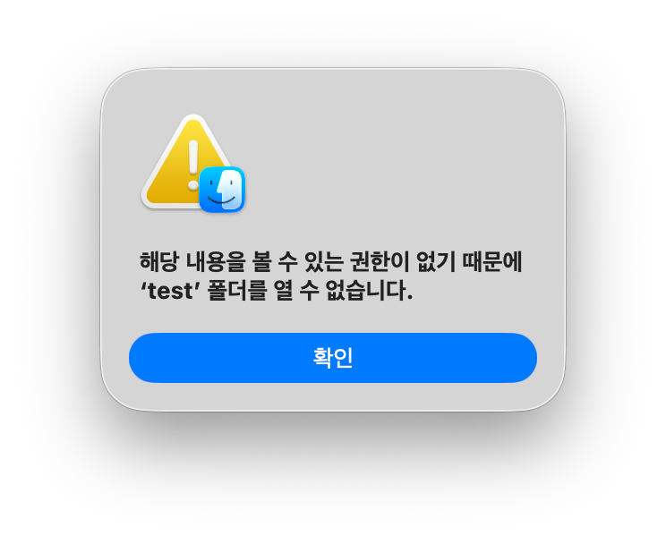

# Codyssey-E1-1: 내 컴퓨터에 개발자용 '작업실' 꾸미기

이번 미션의 목표는 리눅스 CLI(터미널), Docker, Git/GitHub을 직접 세팅해보며, 내가 만든 코드/프로젝트를 다른 컴퓨터에서도 손쉽게 재현 가능할 수 있는 실행 환경을 구축해보는 것이다.


## 0. Pre-Setup
### 0.1 
- 포트 매핑(Port Mapping): 외부(내 PC, 인터넷 등)에서 오는 요청을 네트워크 내부(가상머신, 컨테이너 등)의 특정 공간으로 연결해주는 작업. ≈ 통로 연결
    - ⓔ `-p 8080:80`: 내 PC의 8080번 포트로 들어오면 컨테이너 내부의 80번 포트로 연결
- 데이터 영속성: 프로그램/컨테이너가 종료되거나 전원이 꺼져도, 데이터가 사라지지 않고 지속적으로 유지/저장되는 특성
- 바인트 마운트/볼륨: Docker Container가 꺼지거나 삭제 되어도 데이터를 영속하게 유지하고, 내 PC와 Container 간 파일/폴더를 공유하기 위한 기술
    - 바인트 마운트(Bint Mount): 내 PC의 특정 폴더를 컨테이너와 직접 연결해서 코드 수정할 때 쓰는 방식
    - 볼륨(Volume): Docker가 관리하는 안전한 창고에 DB/데이터를 안 날아가게 보관할 때 쓰는 방식

    | 구분 | **바인드 마운트 (Bind Mount)** | **볼륨 (Volume)** |
    | :--- | :--- | :--- |
    | **저장 위치** | 내 PC의 **특정 원하는 폴더 경로**| Docker가 직접 관리하는 **격리된 전용 저장 공간** |
    | **관리 주체** | 사용자가 직접 폴더 및 파일 관리 | **Docker**가 전적으로 관리 (`docker volume` 명령어) |
    | **주요 용도** | **개발 환경** (내 PC에서 코드 수정시 컨테이너에 즉시 반영) | **운영/DB 환경** (데이터 보존, 백업, 성능 중심) |
    | **특징** | 내 PC의 기존 파일/폴더를 그대로 연결 | Docker 외의 일반 사용자가 직접 파일 수정하기 어려움 |
    | **명령어 예시** | `-v /Users/me/app:/app` <br> => 내 PC의 `/Users/me/app` 폴더 ~ 컨테이너의 `/app` 경로 연결| `-v my_db_data:/var/lib/mysql` <br> => Docker 전용 공간의 `my_db_data`라는 창고를 만들고 DB 저장 경로 `/var/lib/mysql` 와 연결|
- **Terminal VS Shell VS Console **
    |      | 터미널 (Terminal) | 쉘 (Shell) |
    | :--- | :--- | :--- |
    | **역할** | 사용자의 입력을 받고 결과를 화면에 보여주는 껍데기/앱 | 사용자가 입력한 명령어를 해석해서 OS에 전달하는 엔진 |
    | **비유** | 모니터 + 키보드 (인터페이스) | 명령을 알아듣고 처리하는 통역사 / 뇌 |
    | **종류** | macOS Terminal, iTerm2, VS Code Terminal, Warp 등 | bash, zsh, fish, powershell 등 |

- **절대 경로, 상대 경로**
    | 구분 | **절대 경로 (Absolute Path)** | **상대 경로 (Relative Path)** |
    | :--- | :--- | :--- |
    | **기준점** | **최상위 루트 디렉토리 (`/`)** | **현재 내가 위치한 디렉토리 (`.`)** |
    | **특징** | 출발점에 상관없이 경로가 항상 일정함 | 내가 어디 있느냐에 따라 작성하는 경로가 달라짐 |
    | **장점** | 어디서 실행하든 확실하게 목적지를 찾아감 | 경로가 짧고 깔끔하며, 폴더를 통째로 옮겨도 경로가 안 깨짐 |
    | **표기 예시** | `/Users/username/Desktop/project/index.js` | `./index.js` 또는 `../src/app.js` |


### 0.2 Docker 관련
- Docker Demon: 도커의 엔진 역할을 한는 백그라운드 실행 프로세스. ≈ 공장장
    1. 명령 대기: 사용자가 명령어 입력하면, 요청을 받아서 해석
    2. 리소스 관리: docker image(설계도)를 내려받고, container(실제제품)를 생성/실행하며, 네트워크/저장공간 관리
    3. 백그라운드 실행: 눈에 안보여도 시스템 뒤편(dockerd)에서 계속 container 돌봄
    - docker demon은 OS의 커널과 직접 소통하며 자원 할당하기 때문에 보통 root 권한으로 실행됨 ← sudo 필요
- **서울캠퍼스 환경에서 sudo 권한 명령어 사용이 제한되는 이유?**
    - sudo: 관리자(root) 권한으로 명령어 실행을 요청하는 명렁어. 'SuperUser Do' 또는 'Substitute User Do'
    - 다수가 사용하는 공용 시스템의 보안 사고 방지(악성 코드, 시스템 설정 파일 삭제 등)
- **Docker 대신 OrbStack을 사용하는 이유?**
    - Rootless 방식의 동작
        - 기존 Docker: Docker Demon이 내 PC의 root 권한으로 실행
        - OrbStack: 일반 사용자 권한으로 띄운 VM의 관리자 권한으로 Docker Demon 제어

        |         | Docker                          | OrbStack                        |
        | ------- | ------------------------------- | ------------------------------- |
        | **구조**      | 내 PC > 무거운 Linux VM > Container | 내 PC > 초경량 Linux VM > Container |
        | **sudo 우회** | 내 PC의 root 권한 요구                | VM의 root 권한 요구                  |
- **이미지 (Image)**
    - 컨테이너를 생성하기 위한 실행 가능한 읽기 전용 템플릿. ≈ 설계도
    - 애플리케이션 실행에 필요한 코드,라이브러리,환경변수,설정 등이 포함됨
- **컨테이너 (Container)**
    - 이미지를 바탕으로 격리된 공간에서 실제로 실행되는 프로세스
    - 하나의 이미지로 여러개의 독립된 컨테이너 생성 가능

- 컨테이너 VS 가상머신 ??


## 1. 실행 환경
|        |        |
| ------ | ------ |
| OS     | mac OS |
| Shell  | zsh    |
| Docker(OrbStack) | 29.4.0 |
| Git    | 2.50.1 |


```
$ sw_vers -productVersion
26.5.2

$ echo $SHELL
/bin/zsh

$ docker --version
Docker version 29.4.0, build 9d7ad9f

$ git --version
git version 2.50.1 (Apple Git-155)
```


## 2. 수행 체크리스트
- [x] [터미널 기본 조작 및 폴더 구성](#41-터미널-기본-명령어-실습)
- [x] [권한 변경 실습](#42-권한-실습)
- [x] [Docker,OrbStack 설치/점검](#51-dockerorbstack-설치-및-기본--점검)
- [ ] hello-world 실행
- [ ] Dockerfile 빌드/실행
- [ ] 포트 매핑 접속(2회)
- [ ] 바인드 마운트 반영
- [ ] 볼륨 영속성
- [ ] Git 설정 + VSCode GitHub 연동

## 3. 디렉토리 구조


## 4. GitHub 연동
```
# 연동 전
$ git config --list 
credential.helper=osxkeychain
core.repositoryformatversion=0
core.filemode=true
core.bare=false
core.logallrefupdates=true
core.ignorecase=true
core.precomposeunicode=true
remote.origin.url=https://github.com/ottermere21/codyssey-e1-1-workstation.git
remote.origin.fetch=+refs/heads/*:refs/remotes/origin/*
branch.main.remote=origin
branch.main.merge=refs/heads/main
branch.main.vscode-merge-base=origin/main


# 연동
$ git config user.name "ottermere21"
$ git config user.email "ottermere21@gmail.com"

# 연동 완료
$ git config --list
credential.helper=osxkeychain
core.repositoryformatversion=0
core.filemode=true
core.bare=false
core.logallrefupdates=true
core.ignorecase=true
core.precomposeunicode=true
remote.origin.url=https://github.com/ottermere21/codyssey-e1-1-workstation.git
remote.origin.fetch=+refs/heads/*:refs/remotes/origin/*
branch.main.remote=origin
branch.main.merge=refs/heads/main
branch.main.vscode-merge-base=origin/main
user.name=ottermere21
user.email=ottermere21@gmail.com
```


## 5. Terminal
| **명령어** | **기능** | **명령어** | **기능** |
| --- | --- | --- | --- |
| **`pwd`** | 현재 작업 위치(폴더) 경로 출력 <br> print working directory | **`mkdir <폴더명>`** | 새로운 폴더 생성 |
| **`ls -al`** | 숨김 파일 포함 전체 목록 보기 <br> list | **`touch <파일명>`** | 빈 파일 생성 |
| **`cd <경로>`** | 지정한 폴더 위치로 이동 | **`cp <원본> <복사본>`** | 파일 복사 (`-r`은 폴더) |
| **`cd ..`** | 상위(이전) 폴더로 이동 | **`mv <이동> <목적지>`** | 파일 이동 및 이름 변경 |
| **`cd ~`** | 홈 디렉토리로 바로 이동 | **`rm <파일명>`** | 파일 삭제 (휴지통 안 거침) |
| **`cat <파일명>`** | 파일 내용 전체 출력 <br> concatenate | **`rm -rf <폴더명>`** | 폴더 및 내부 파일 전체 삭제 |
| **`clear`** | 터미널 화면 깨끗이 정돈 | **`open .`** | 현재 폴더를 맥 Finder로 열기 | 

| 기호 / 옵션 | 풀이 | 의미 |
| :--- | :--- | :--- |
| **`-al`** | **a**ll + **l**ong | 숨김 파일 포함(`-a`)해서, 권한·크기·날짜 등 상세 정보(`-l`)까지 전부 보여주는 `ls` 옵션 |
| **`-rf`** | **r**ecursive + **f**orce | 폴더 내부까지 재귀적으로 하위 항목 전부 포함(`-r`)하고, 경고 없이 강제로(`-f`) 삭제하는 `rm` 옵션 |
| **`..`** | Upper Directory | **상위(이전) 폴더**를 나타내는 경로 기호 <br>(예: `cd ..`) |
| **`.`** | Current Directory | **현재 위치한 폴더**를 나타내는 경로 기호 <br>(예: `open .`, `./script.sh`) |
| **`~`** | Home Directory | 로그인한 **사용자의 홈 폴더 경로**(`/Users/사용자명`)를 뜻하는 줄임표 <br> (예: `cd ~`) |

### 4.1 터미널 기본 명령어 실습
```
# 1. 현재 위치 확인
$ pwd
/Users/ys/Desktop/STUDY/Codyssey/codyssey-e1-1-workstation


# 2. 목록 확인 (숨김 파일 포함)
$ ls
README.md

$ ls -a
.		..		.DS_Store	.git    .gitignore	README.md

$ ls -al
total 64
drwxr-xr-x   6 ys  staff    192  8월  3 19:36 .
drwxr-xr-x@  7 ys  staff    224  8월  3 19:29 ..
-rw-r--r--@  1 ys  staff   6148  8월  3 19:28 .DS_Store
drwxr-xr-x  13 ys  staff    416  7월 31 00:40 .git
-rw-r--r--@  1 ys  staff      9  8월  3 19:32 .gitignore
-rw-r--r--@  1 ys  staff  17784  8월  3 19:05 README.md


# 3. 생성
$ mkdir test


# 4. 이동 
$ cd test


# 5. 빈파일 생성
$ touch test.txt


# 6. 내용 작성 및 출력
$ echo "test" > test.txt
$ cat test.txt
test

# 덮어쓰기
$ echo "hello" > test.txt
$ cat test.txt
hello

# 추가로 이어서 작성
$ echo "안녕하세요" >> test.txt
$ cat test.txt
hello
안녕하세요


# 7. 복사
$ cp test.txt test1.txt
$ ls
test.txt	test1.txt


# 8. 이름변경
$ mv test1.txt rename.txt
$ ls
rename.txt	test.txt


# 9. 이동
$ mv rename.txt ..
$ ls
test.txt

$ cd .. 
$ ls
README.md	rename.txt	test


# 10. 삭제
$ rm rename.txt
$ ls
README.md	test

$ rm -rf test
$ ls
README.md
```

### 4.2 권한 실습
| 구분 | 권한 기호 (`rwx`) | 8진수 숫자 | 파일에서의 의미 | 디렉토리에서의 의미 | 자주 쓰이는 조합 예시 |
| :--- | :---: | :---: | :--- | :--- | :--- |
| **Read (읽기)** | **`r`** | **4** | 파일 내용 조회 (`cat` 등) | 폴더 내부 파일 목록 확인 (`ls`) | • **`644`** (`rw-r--r--`): 일반 파일 기본값 |
| **Write (쓰기)** | **`w`** | **2** | 파일 내용 수정/삭제 | 폴더 내 파일 생성/삭제/이름 변경 | • **`755`** (`rwxr-xr-x`): 일반 디렉토리/실행 파일 기본값 |
| **Execute (실행)** | **`x`** | **1** | 프로그램/스크립트 실행 | 폴더 내부로 접근/이동 (`cd`) | • **`700`** (`rwx------`): 개인 전용 비밀 파일/키 |
| **Denied (없음)** | **`-`** | **0** | 권한 없음 | 권한 없음 | • **`777`** (`rwxrwxrwx`): 모든 사용자 전체 허용 (주의) |

#### 현재 권한 확인
```
$ ls -l
total 40
-rw-r--r--@ 1 ys  staff  17597  8월  3 20:04 README.md
drwxr-xr-x  2 ys  staff     64  8월  3 20:06 test
-rw-r--r--  1 ys  staff      0  8월  3 20:06 test.txt
```

|           | 기존 권한           | 소유자(User) | 그룹(Group) | 기타 사용자(Others) |
| --------- | --------------- | --------- | --------- | -------------- |
| test.txt  | rw-r--r-- (644) | 읽기/쓰기     | 읽기 전용     | 읽기 전용          |
| test 디렉토리 | rwxr-xr-x (755) | 읽기/쓰기/실행  | 읽기/실행     | 읽기/실행          |

#### 실습1: 모든 권한 제한
```
$ chmod 000 test.txt
$ chmod 000 test
$ ls -l test.txt
total 40
-rw-r--r--@ 1 ys  staff  17597  8월  3 20:07 README.md
d---------  2 ys  staff     64  8월  3 20:06 test
----------  1 ys  staff      0  8월  3 20:06 test.txt

```

|           | 변경된 권한           | 소유자(User) | 그룹(Group) | 기타 사용자(Others) |
| --------- | --------------- | --------- | --------- | -------------- |
| test.txt  | ---------  (000) | X | X | X |
| test 디렉토리 | --------- (000) | X | X | X |




```
$ chmod 644 test.txt
$ chmod 755 test
$ ls -l test.txt
total 40
-rw-r--r--@ 1 ys  staff  17572  8월  3 20:16 README.md
drwxr-xr-x  2 ys  staff     64  8월  3 20:06 test
-rw-r--r--  1 ys  staff      0  8월  3 20:06 test.txt

```


## 5. Docker
### 5.1 Docker/OrbStack 설치 및 기본  점검
```
$ docker --version
Docker version 29.4.0, build 9d7ad9f

$ docker info
Client:
 Version:    29.4.0
 Context:    orbstack
 Debug Mode: false
(이하 생략)

# OrbStack 실행 전 - docker demon 실행 X
$ docker ps
failed to connect to the docker API at unix:///Users/ys/.orbstack/run/docker.sock; check if the path is correct and if the daemon is running: dial unix /Users/ys/.orbstack/run/docker.sock: connect: no such file or directory


# OrbStack 실행 후 - 작동 중임을 알 수 있음
$ docker ps
CONTAINER ID   IMAGE     COMMAND   CREATED   STATUS    PORTS     NAMES

$ orb status 
Running
# OrbStack의 가상머신이 잘 작동하고 있음

```


## ⚠️ 트러블 슈팅
### 1. .DS_Store
 .DS_Store 파일은 Desktop Services Store로, Finder에서 해당 폴더를 볼 때 설정 했던 보기 옵션(아이콘 위치, 크기, 보기 방식, 배경색 등)을 저장하는 파일이다. 따라서 GitHub에는 올릴 필요가 전혀 없는 파일이다.
  하지만 이미 커밋을 해서 GitHub에 올라와있는 상태이다. 

## ☑️ 기능 요구 사항 Checklist
**1. 제출 저장소 및 기술 문서**
- [ ] GitHub Repository 링크로 제출한다.
- 기술 문서(README.md 등)는 아래 내용을 반드시 포함한다.
    - [ ] 모든 수행 결과는 “기술 문서(README.md 등)”에서 확인 가능해야 한다.
    - [x] 프로젝트 개요(미션 목표 요약)
    - [x] 실행 환경(OS/쉘/터미널, Docker 버전, Git 버전)
    - [ ] 수행 항목 체크리스트(터미널/권한/Docker/Dockerfile/포트/마운트/볼륨/Git/GitHub)
    - [ ] 검증 방법(어떤 명령으로 무엇을 확인했는지) + 결과 위치/증거 링크
- [ ] 기술 문서 내 명령/출력은 코드블록으로 정리한다.

**2. 터미널 조작 로그 기록**
- 다음 작업을 터미널로 수행하고, 명령어 + 출력 결과를 기술 문서에 기록한다.
    - [x] 현재 위치 확인, 목록 확인(숨김 파일 포함), 이동, 생성, 복사, 이동/이름변경, 삭제
    - [x] 파일 내용 확인, 빈 파일 생성

**3. 권한 실습 및 증거 기록**
- [x] 권한을 확인/변경하는 명령을 수행하고, 변경 전/후 비교를 기술 문서에 남긴다.
- [x] 최소 요구: 파일 1개, 디렉토리 1개에 대해 권한 변경 실험을 수행한다.

**4. Docker 설치 및 기본 점검**
- [ ] Docker 버전 확인 결과를 기록한다. (docker --version)
- [ ] Docker 데몬 동작 여부 확인 결과를 기록한다. (docker info 또는 동등 점검)

**5. Docker 기본 운영 명령 수행**
- [ ] 이미지: 다운로드/목록 확인 (예: docker images)
- [ ] 컨테이너: 실행/중지/목록 확인 (예: docker ps, docker ps -a)
- [ ] 운영: 로그 확인 (예: docker logs), 리소스 확인 (예: docker stats)
- [ ] 수행 명령과 출력 결과를 기술 문서에 남긴다.

**6. 컨테이너 실행 실습**
- [ ] hello-world 실행 성공을 기록한다.
- [ ] ubuntu 컨테이너를 실행하고 내부 진입 후 간단 명령(예: ls, echo) 수행 결과를 기록한다.
- [ ] 컨테이너 종료/유지(attach/exec 등)의 차이를 스스로 관찰하고 간단히 정리한다.

**7. 기존 Dockerfile 기반 커스텀 이미지 제작**
- 아래 방식 중 하나를 선택하여 기존 Dockerfile/이미지 기반의 커스텀 이미지를 만든다.
    - [ ] (A) 웹 서버 베이스 이미지 활용(예: NGINX/Apache 등) + 정적 콘텐츠/설정만 교체
    - [ ] (B) Linux 베이스 이미지(예: ubuntu/alpine 등) + 기본 기능(패키지/사용자/환경변수/헬스체크 등) 추가
- 제작 결과는 아래 조건을 만족해야 한다.
    - [ ] 커스텀 이미지 빌드 성공 및 컨테이너 실행 성공
    - 기술 문서에 다음을 포함한다.
        - [ ] 어떤 “기존 베이스(이미지/예시 Dockerfile)”를 선택했는지
        - [ ] 내가 적용한 커스텀 포인트 각각의 목적(간단 요약)
        - [ ] 빌드/실행 명령 + 핵심 결과(출력/스크린샷)

**8. 포트 매핑 및 접속 증거**
- [ ] 브라우저 접속 화면(또는 curl 응답)을 기술 문서에 첨부한다.

**9. Docker 볼륨 영속성 검증**
- [ ] Docker 볼륨을 생성하고 컨테이너에 연결한다.
- [ ] 컨테이너 삭제 전/후로 데이터를 확인하여 데이터가 유지됨을 증명한다.
- [ ] 기술 문서에 생성/연결/검증 절차(명령+출력)를 포함한다.

**10. Git 설정 및 GitHub 연동**
- [ ] Git 사용자 정보/기본 브랜치 설정을 완료하고 git config --list 결과를 기록한다.
- [ ] GitHub 로그인 및 저장소 연동을 완료하고, 연동 증거(스크린샷 등)를 기술 문서에 첨부한다.

**11. 보안 및 개인정보 보호**
- [ ] 기술 문서/로그/스크린샷에 토큰, 비밀번호, 개인키, 인증 코드 등이 포함되지 않도록 마스킹한다.
- [ ] 의심되는 민감정보가 노출된 경우, 즉시 히스토리/문서에서 제거하고 재발급 절차를 수행한다 (가능한 범위에서).


## ☑️ 최종 결과물 Checklist
**1. 제출 저장소(GitHub Repository)**
- [ ] 공개(또는 과제 제출 규칙에 맞는 권한)로 생성한다.
- [ ] 저장소 링크만으로 아래 산출물 전부를 확인할 수 있어야 한다.

**2. 기술 문서(README.md 등)**
- [ ] 프로젝트 개요(미션 목표 요약)
- [ ] 실행 환경(OS/쉘/터미널, Docker 버전, Git 버전)
- [ ] 수행 항목 체크리스트(터미널/권한/Docker/Dockerfile/포트/볼륨/Git/GitHub)
- [ ] 검증 방법(어떤 명령으로 무엇을 확인했는지) + 결과 위치 링크
- [ ] 트러블슈팅 2건 이상(문제 → 원인 가설 → 확인 → 해결/대안)
- [ ] 기술 문서만 읽어도 전체 수행 내용을 파악할 수 있어야 한다.

**3. 터미널 조작 로그**
- [ ] 터미널에서 수행한 핵심 명령과 출력 결과를 기술 문서에 기록한다.

**4. Docker 운영/검증 로그**
- [ ] docker --version, docker info 등 설치·점검 결과
- [ ] docker images, docker ps -a, docker logs, docker stats 등 운영 명령 실행 흔적

**5. Dockerfile 기반 웹 서버 컨테이너**
- [ ] 웹 서버 소스코드(예: app/ 또는 src/)
- [ ] Dockerfile
- [ ] 빌드/실행 명령 및 결과 로그(터미널 스크린샷 가능)
- [ ] 포트 매핑 접속 성공 증거(스크린샷 또는 로그)

**6. 포트 매핑 접속 증거**
- [ ] p <host_port>:<container_port>로 실행 후, 브라우저 접속 화면(주소창 포함)을 기술 문서에 첨부한다.

**7. 바인드 마운트 반영 + 볼륨 영속성 증거**
- [ ] 바인드 마운트: 실행 명령 + 호스트 변경 전/후 비교
- [ ] Docker 볼륨: 생성/연결/검증 명령 + 컨테이너 삭제 전/후 비교

**8. Git 설정 및 GitHub/VSCode 연동 증거**
- [ ] Git 사용자 정보·기본 브랜치 설정 후, VSCode에서 GitHub 로그인 및 저장소 연동 완료
- [ ] 민감한 개인 정보(ID/PW, 토큰 등)가 포함되지 않도록 주의한다.

** mission.png 파일 삭제하기 **